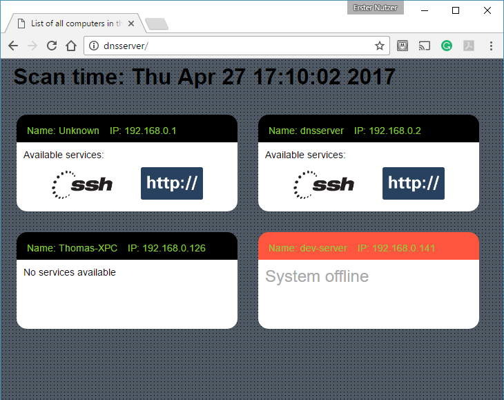

# lan-monitor

## Dowload here [github-release](https://github.com/KruDex/lan-monitor/releases/latest)

## What it does

This software builds a dynamic graphical website showing the computers with their hostnames and IP addresses in the local network.

It is for laboratory or home type networks to get a quick impression of the computers online without requiring additional soft or hardware.



## Features

- Easy to understand graphical representation
- Shows the hostname and IP address
- Shows if the computer is running a webserver with clickable link
- Shows is the computer is accessible via SSH
- Shows if a computer has gone offline

## How it works

It is based on a periodically executed nmap scan. The result of this scan, a xml file, is parsed by the JavaScript and represented as html page with boxes presenting information for each computer.

## Installation

### Automatic installation by using the provided Debian package

If running on Debian or a deb base package manager you can use the debian packages provided [here](https://github.com/KruDex/lan-monitor/releases/latest).

#### WARNINGS for debian package

It automatically starts a webserver on port 8080. In case another application is using this port it will fail starting or prevents the other application from start. The port can be configured either in the config file */etc/lan-monitor.conf* or using the commandline option.

##### Not everything is automatic or configurable by the web interface (yet)

The ip range or adresses that are planned to scan are either set in the config file  */etc/lan-monitor.conf* or command line option.

### Automatic installation procedure

This package requires nmap you can install it by typing:

```bash
apt install nmap
```

Installation of the package

```bash
dpkg -i lan-monitor.deb
```

If nmap is not installed apt will complain and the missing package. It can be installed by typing:

```bash
apt-get install -f
```

### Test the installation

If you enter not the ip address or the computer name in the browser it should display the computers in the lan e.g. (http://192.168.1.2:8080) on the computer itself (http://127.0.01:8080). It can take a few minutes until the first nmap scan is completed. There should be the file scan.xml in the */var/opt/lan-monitor* folder.

### Manual installation

To install the required components and the configuration of the webserver can also be done manually. This is recommended if there are is already a webserver is in use and/or for greater control of the system.

#### Files for the website

The files to display the website are in the www folder of this repository. The scan.xml from the NMAP scan results needs to be in the same location as the index.html.

#### Webserver executable

The executable, managing the periodic scan and serving the webpages is a go executable. It expects the website in a path ../www relative to it. Later this should be configurable via a config file.

#### NMAP installation

The source file for the parsing is build on a nmap scan result in xml format. On Debian it can be installed by

```bash
apt get install nmap
```

#### Used NMAP Options for the scan

- -p for scanning the ports 22 and 80
- -oX output file
- scanning the 192.168.1.0/24 subnet
