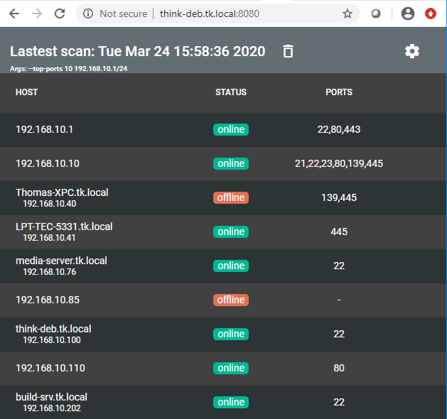
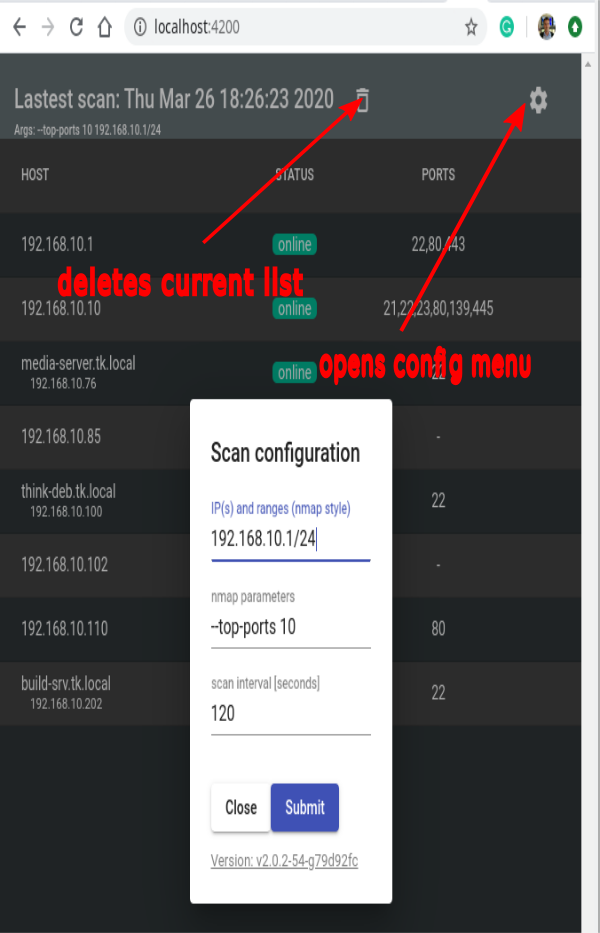
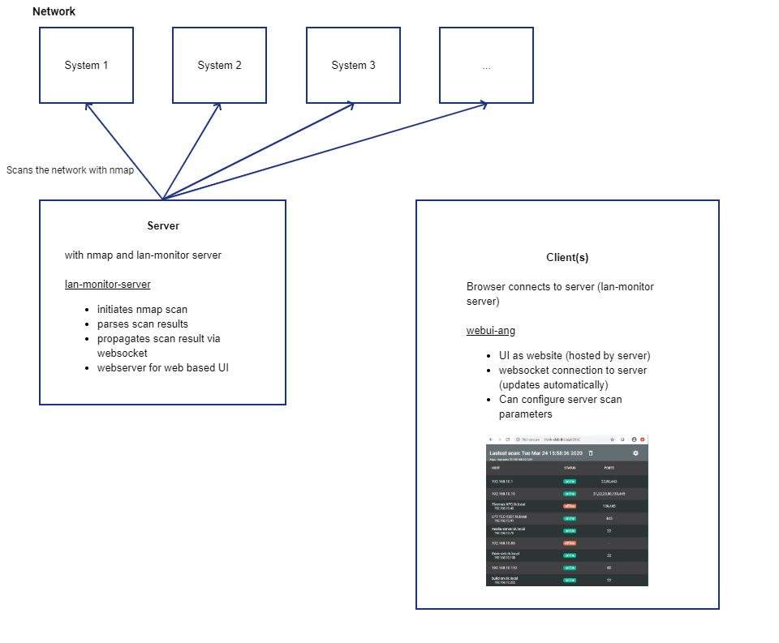

# lan-monitor

## Dowload here [github-release](https://github.com/KruDex/lan-monitor/releases/latest)

## What it does

This software builds a dynamic graphical website showing the results of a NMAP scan. This tool has an integrated webserver to display this website with the hostnames, IP addresses and selected open ports.

This is a general description for more details please read here:

- [Installation](./installation_manual.md)
- [Build](./pkg-build/build-manual.md)
- [Docker](dockerimages/docker-readme.md)

## Ideas and intentions

## Scanning local area networks

The original intention was to get a quick overview of local laboratory or home networks. For the user to see immideately the status of the computers connected. Basically important open ports (ssh, http) and also if a computers have been switched off. The visualisation is a  website accessible by everybody inside independend of used OS. This way everyone can see the real time network status e.g.  to see if a certain device is online and accessible. In our lab with a lot of embedded devices this is very practical without pinging and looking up names or ip addresses.

### Scanning public IP-addresses

From some interactions I learned that this could be also of interest. I would be happy to learn with features might be interesting here. e.g. scan more ports, display them, nmap --top-ports, ... **just raise an issue and we can work on it together**

## Features

- Easy to understand graphical representation
- Shows the hostname and IP address
- Shows if the computer is running a webserver with clickable link (not available right now)
- Shows is the computer is accessible via SSH
- Shows if a computer has gone offline
- the scan parameters can be configure via the web interfaces

## How it works

It is based on a periodically executed nmap scan. The result of this scan, a xml file, is transformed to JSON and the server hosting the websites visualisiation will sent the result of each scan to the connected clients via websockets.

## Usage

The benefit for the user is to have an overview of the network. She sees which systems are online with which ports open. In addtion there is information if a system has gone offline. Howeber this is specific to the **current client and its local stored list**. For illustration if client A is online since 8:00 am and one computer that was in its list is switched off at 8:30 am it will display it as *offline*. If another client (client B) is swichted on at 10:00 am it will not see this machine at all. Especially not marked as offline since it never new that is was online before.

### Delete current stored list

The client can delete the indivitually stored list by clicking on the trash bin button at the top.

### Configure the scan

The client can send the server a message with which parameters and/or which IP addressses nmap should scan. The next time the server scans this will be updated. **Warning** this will affect all clients connected to that server.

## Architecture

The figure below shows in brief the components of the system. 

### lan-monitor-server

This go program triggers the nmap scan and host the pages for the web ui. After each scan it sends the results to its clients.

### Client: webui-ang

This is the website for the user interaction. It is hosted on the server and retrieves updates on the scans via websocktes. It is written with the Angular framework.
